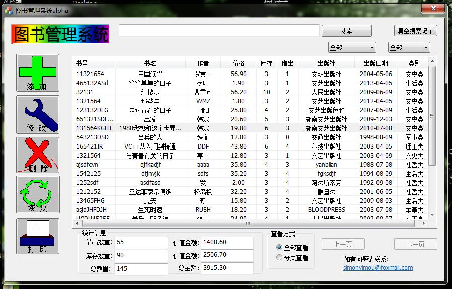

# libsys
library management system in C++/MFC/Access

This is my project work of the course "Object-Oriented Programming-C++", which I took in my 1st year of undergraduate.

I wanted my work to be more novel than peer students, who were struggling to use plain c++ code and only show results in terminate console. Therefore the idea of designing a desktop version which can be used by ordinary people came out of my mind.

The project using c++ to impletement control flow and communication with database, Access, wihch was the first I know about databases when I was in that time.
MFC feature integrated in Microsoft Visual Studio 2012 helped me a lot to do UI design.

If you want to load the project completely, including solution or something, you need to have Microsoft Visual Studio 2010 or higher version.

Source files are in directory \LibraryBeta03\LibraryBeta03\

Explanation:

LibraryBeta03Dlg.h and LibraryBeta03Dlg.cpp are for main user interface.

AddInfoDlg.h and AddInfoDlg.cpp are for "Add info" dialog window.

ModifyInfo.h and ModifyInfo.cpp are for "Modify info" dialog window.

recover.h and recover.cpp are for "Recover info from recyle bin" dialog window.

printDlg.h and printDlg.cpp are for "Export all info into excle file".

Cdata1.h和Cdata1.cpp是添加ODBC使用者类连接数据库产生的类的文件，该数据库用以保存图书信息

Cdata2.h和Cdata2.cpp是添加ODBC使用者类连接数据库产生的类的文件，该数据库用以保存已删除信息。同时也只保存最近的3条记录。